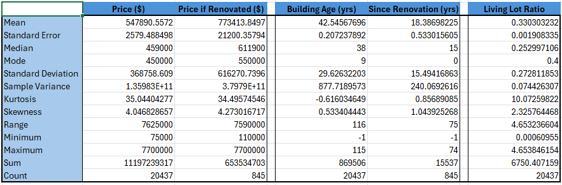
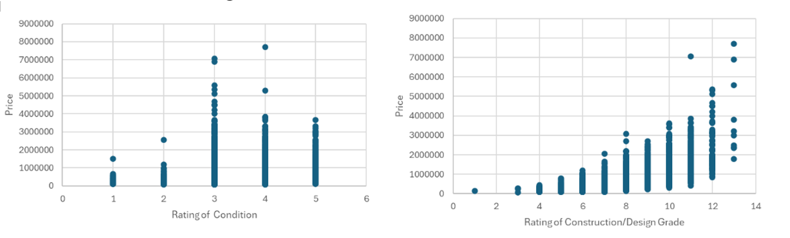
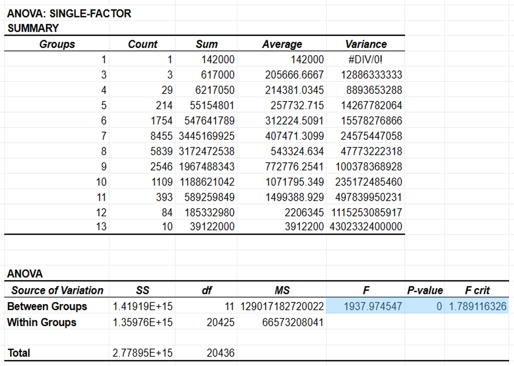
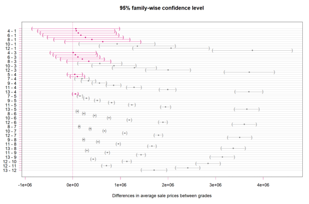
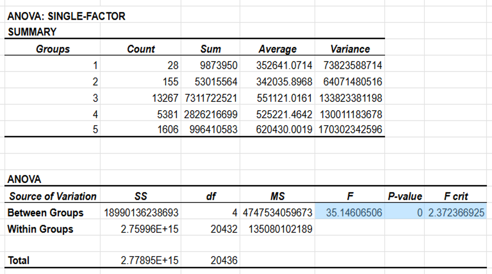
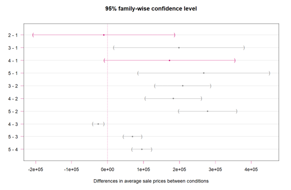
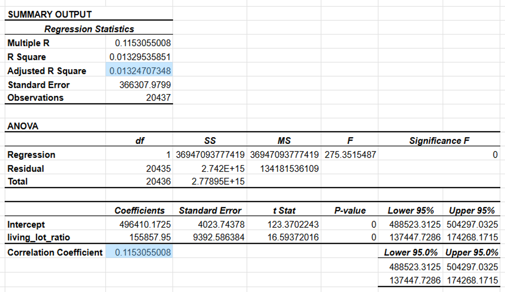
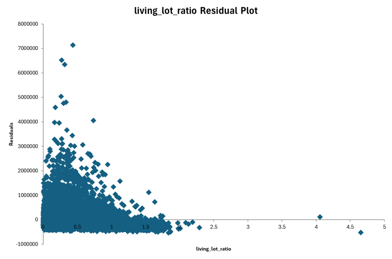
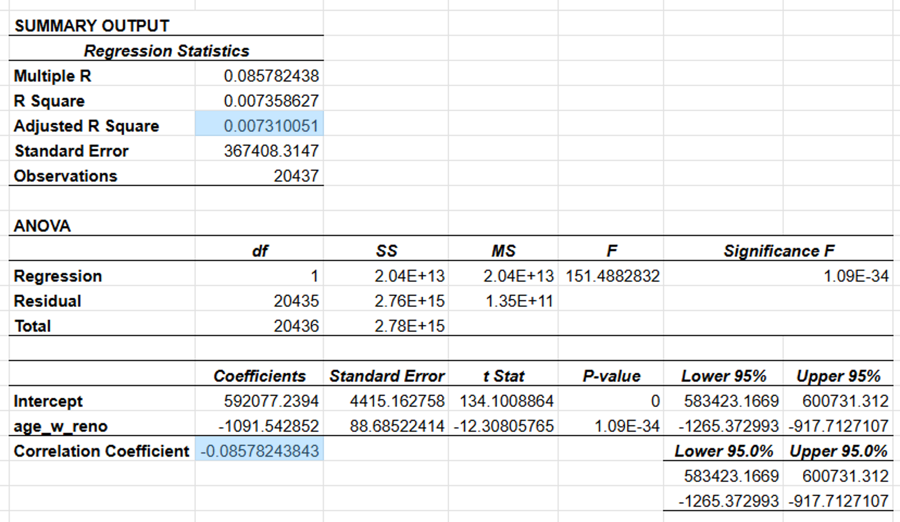
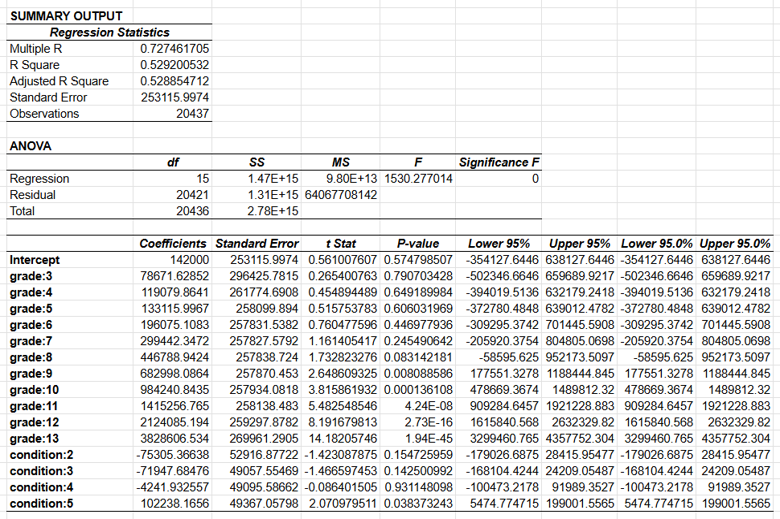

# Seattle Housing Price Analysis
## Final Project Report

> **Course:** ADTA 5130 — Data Analytics I
> **Institution:** University of North Texas

---

## Table of Contents

- [Exploratory Data Analysis](#-exploratory-data-analysis)
- [Hypotheses](#-hypotheses)
- [Results](#-results)
- [Conclusion](#-conclusion)

---

## Exploratory Data Analysis

### Data Overview

The dataset contains approximately **20,000 housing sales records** from the Seattle, Washington area between May 2014 and May 2015. It includes data on sale date, price, location, and various property attributes.

**Focus areas for this analysis:**

| Focus Area | Variables |
|------------|-----------|
| Property age and renovation | `yr_built`, `yr_renovated`, `building_age`, `yrs_since_reno` |
| Condition and grade | `condition` (1–5), `grade` (1–13) |
| Living-lot ratio | `sqft_living / sqft_lot` |

---

### Descriptive Statistics

 <em>Table 1 — Descriptive statistics of relevant numeric variables</em>

---

### Price Distribution

The sample variance (**135,982,911,732.36**) is extremely high — over seventeen thousand times larger than the maximum recorded price ($7,700,000). This indicates that a large proportion of house prices are significantly dispersed from the mean, making simple mean comparisons insufficient and motivating more rigorous statistical testing.

---

### Property Age Distribution

| Age Bracket | Properties Sold |
|-------------|----------------|
| 0–20 years | **5,638** (highest volume) |
| 20–40 years | Decreasing trend |
| 40–60 years | Decreasing trend |
| 60–80 years | Decreasing trend |
| 80–100 years | Decreasing trend |
| 100–120 years | **1,063** (lowest — over 80% lower than newest bracket) |

**Notable:** Twelve properties had negative ages (sold before construction completion), likely due to pre-construction deals or data entry errors — these warrant further investigation.

The decline in sales with age indicates the market favors newer homes, likely due to maintenance concerns and preservation regulations on older properties.

---

### Living-Lot Ratio

The living-lot ratio measures indoor living space proportional to total outdoor lot size. The dataset contains notable outliers in both directions:

- **Very small lots relative to living space** → likely townhomes on individual lots
- **Very large lots relative to living space** → likely individual condominiums in shared complexes

These outliers may be muddying price comparisons and should be addressed in future analyses.

---

### Condition and Grade Ratings

 <em>Figure 1 (left) — Price by Condition &nbsp;&nbsp;&nbsp;&nbsp; Figure 2 (right) — Price by Grade &nbsp;</em>

#### Property Condition

| Condition | Properties Sold | Notes |
|-----------|----------------|-------|
| 1 (Very Poor) | 28 | Rarely sold |
| 2 (Poor) | 155 | Rarely sold |
| 3 (Average) | **13,267** | Majority of market |
| 4 (Good) | 5,381 | Significant portion |
| 5 (Excellent) | 1,606 | Smaller upscale market |

Most properties sold fall into the **average condition** category. Buyers appear to prefer properties in standard-to-good condition.

#### Construction & Design Grade

| Grade Range | Level | Notable Count |
|-------------|-------|---------------|
| 1–3 | Below standard | Only 4–5 properties |
| 7 | Average | **7,455** (most common) |
| 8 | Above average | 5,839 |
| 11–13 | High quality | 487 |

The majority of sold properties cluster at **average or above-average** grade, with very few at either extreme.

---

## 🔬 Hypotheses

| # | Comparison | Research Question | Null Hypothesis | Alternative Hypothesis | Method |
|---|-----------|-------------------|-----------------|------------------------|--------|
| **H1** | Grade & Price | Does grade influence sale price? | H₀: μ₁ = μ₂ = μ₃ | Hₐ: Not all means equal | ANOVA + Tukey's HSD |
| **H2** | Condition & Price | Does condition influence sale price? | H₀: μ₁ = μ₂ = μ₃ | Hₐ: Not all means equal | ANOVA + Tukey's HSD |
| **H3** | Living-Lot Ratio & Price | How much does living-lot ratio influence price? | H₀: β₁ = 0 | Hₐ: β₁ ≠ 0 | Simple Linear Regression |
| **H4** | Renovation Age & Price | Does years since renovation influence price? | H₀: β₁ = 0 | Hₐ: β₁ ≠ 0 | Simple Linear Regression |
| **H5** | Condition + Grade & Price | Do condition and grade combined influence price? | H₀: β₁ = β₂ = 0 | Hₐ: At least one βᵢ ≠ 0 | Multiple Regression |

---

## Results

### ANOVA — Grade & Price

 <em>Table 2 — ANOVA results: Grade vs. Sale Price</em>

| Metric | Value |
|--------|-------|
| F Statistic | **1937.97** |
| F Critical | 1.789 |
| p-value | ≈ 0 |
| Significance Level | 0.05 |
| **Decision** | ✅ **Reject H₀** |

The F statistic (1937.97) vastly exceeds the F critical value (1.789), and the p-value is effectively zero — far below the 0.05 significance threshold. **Grade has a statistically significant effect on sale price.** Further pairwise analysis using Tukey's HSD was conducted to identify which specific grade groups differ.

---

#### Tukey's HSD — Grade Pairings

 <em>Figure 3 — 95% Confidence Intervals for pairwise grade mean differences (R/RStudio)</em>

**Key findings:**

- Pairings of **low-to-average grades (≤ 9)** tend to have confidence intervals that include zero → differences are **not statistically significant**
- Pairings involving **grades 9 and above** have larger, more distinct average price differences — the more disparate two grade values, the further from zero the confidence interval
- **Conclusion:** Properties with a grade of 9 or higher are associated with significantly higher sale prices compared to lower-grade properties

---

### ANOVA — Condition & Price

  
   <em>Table 3 — ANOVA results: Condition vs. Sale Price
</em> 

| Metric | Value |
|--------|-------|
| F Statistic | **35.146** |
| F Critical | 2.372 |
| p-value | ≈ 0 |
| Significance Level | 0.05 |
| **Decision** | ✅ **Reject H₀** |

---

#### Tukey's HSD — Condition Pairings

  
   <em>Figure 4 — 95% Confidence Intervals for pairwise condition differences (R/RStudio)
</em> 

**Key findings:**

- Confidence intervals for pairings **2-1** and **4-1** include zero → differences in average sale prices are **not statistically significant**
- Lower condition ratings show **wider confidence intervals** due to fewer observations (conditions 1 and 2 are rare)
- Higher condition ratings have more precise and distinct price differences
- **Conclusion:** Better property condition is generally associated with higher prices, most pronounced when comparing condition 5 to lower ratings

---

### Regression — Living-Lot Ratio & Price

  
   <em>Table 4 — Regression results: Living-Lot Ratio vs. Sale Price
</em>

  
   <em>Table 5 — Residual plot: Living-Lot Ratio regression model
</em>

| Metric | Value |
|--------|-------|
| Adjusted R² | **0.0132** |
| Correlation Coefficient | 0.1153 (positive, weak) |
| **Decision** | ❌ **Accept H₀** |

Only **1.32%** of price variation is explained by living-lot ratio alone. The weak correlation (0.1153) confirms there is no practically meaningful standalone relationship. However, a **distinct pattern in the residual plot** at low ratio values suggests that living-lot ratio may contribute meaningfully within a multiple regression framework with additional variables.

---

### Regression — Renovation Age & Price

  
   <em>Table 6— Regression results: Renovation Age vs. Sale Price 
</em>

| Metric | Value |
|--------|-------|
| Adjusted R² | **0.0074** |
| Correlation Coefficient | −0.0858 (negative, extremely weak) |
| p-value | 1.09E-34 |
| **Decision** | ❌ **Accept H₀** |

Only **0.74%** of price variation is explained by renovation age. Despite a statistically detectable p-value, the relationship is practically negligible. Years since renovation alone is **not a useful predictor** of sale price.

---

### Multiple Regression — Condition + Grade & Price

  
   <em>Table 7 — Multiple regression results: Condition + Grade vs. Sale Price 
</em>

| Metric | Value |
|--------|-------|
| Adjusted R² | **0.5289** |
| **Decision** | ✅ **Reject H₀** |

The combined model explains **52.89%** of all price variation — dramatically higher than any single-factor model. The most statistically significant predictors are:

- **Grade ratings of 9 and above** — aligns with Tukey's HSD findings (Figure 4)
- **Condition rating 5** — aligns with Tukey's HSD findings (Figure 5)

> ⚠️ Grade rating "2" was excluded from this analysis due to insufficient observations in that category.

**Conclusion:** Both grade and condition ratings — particularly at high values — are statistically significant enough to meaningfully influence sale price, and their combined effect is substantially stronger than either factor alone.

---

## Conclusion

This analysis of Seattle-area housing sales data revealed several key findings relevant to real estate pricing strategy.

**Summary of results:**

| Factor | Adjusted R² | Decision | Key Takeaway |
|--------|-------------|----------|--------------|
| Grade (ANOVA) | — | ✅ Reject H₀ | Higher grade = significantly higher price |
| Condition (ANOVA) | — | ✅ Reject H₀ | Better condition = higher price |
| Living-Lot Ratio | 0.013 | ❌ Accept H₀ | Weak predictor alone |
| Renovation Age | 0.007 | ❌ Accept H₀ | Not meaningful alone |
| Grade + Condition | **0.529** | ✅ Reject H₀ | Explains 52.89% of price variation |

The strong influence of **grade** was confirmed by an F statistic of 1937.97 and a near-zero p-value. Tukey's HSD revealed that properties with grades of 9 or above command distinctly higher prices. Condition ratings showed similar patterns — particularly at higher condition levels — though with some non-significant pairings at the lower end (conditions 1, 2, and 4).

Living-lot ratio and renovation age individually showed extremely low explanatory power (R² = 0.013 and 0.007 respectively), though the residual pattern in the living-lot ratio model suggests it may contribute in a more complex multi-variable model.

The multiple regression model combining grade and condition achieved an adjusted R² of **0.5289**, by far the strongest result of this study.

**Recommendations for future analysis:**

- [ ] Expand the multiple regression model to include additional variables: `sqft_living`, `waterfront`, `view`, `zipcode`, `location`
- [ ] Investigate the living-lot ratio outliers (townhomes vs. condominiums) separately
- [ ] Explore non-linear relationships between grade/condition and price
- [ ] Apply the model to a holdout dataset to validate predictive accuracy
- [ ] Investigate the twelve negative-age properties for data quality issues

---

## References

- King County House Sales Dataset (Seattle, WA) — May 2014 to May 2015
- R Core Team. (2024). *R: A language and environment for statistical computing*. R Foundation for Statistical Computing. https://www.r-project.org/
- Tukey, J.W. (1949). Comparing individual means in the analysis of variance. *Biometrics, 5*(2), 99–114.

---

  ADTA 5130 — Data Analytics I | University of North Texas 

